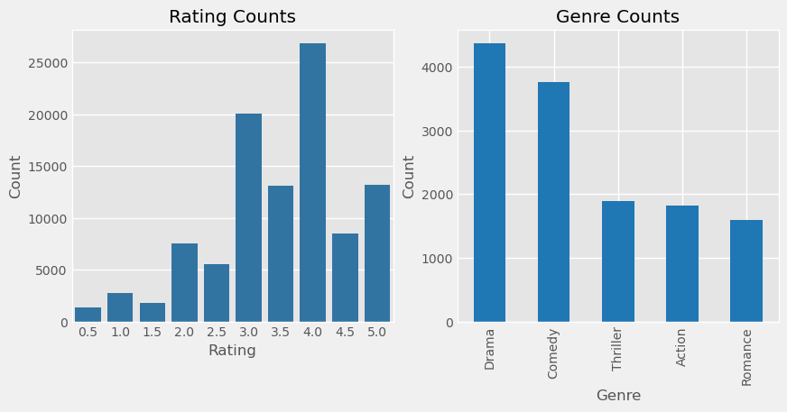
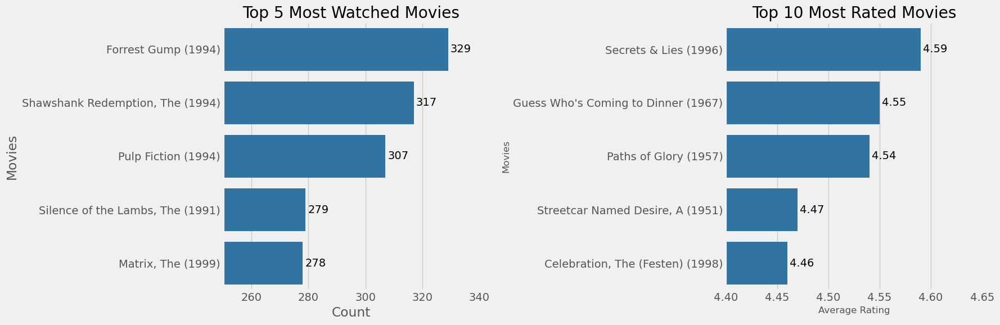

# Hybrid Movie Recommendation System

##  Business Understnding
### a) Introduction
Movies are a popular, widely spread, and recognized form of entertainment that has evolved drastically since its emergence in the 19th century. Movies have become easily accessible with advancements in technology, as filming has evolved from theatre streaming to online streaming, which has become dominant over the past decade. This has resulted in the emergence of online film streaming platforms, like Netflix, Hulu, and Amazon Prime, which provide convenient streaming services to users online and apply regular streaming charges.

StreamHd is an emerging online streaming platform, that provides access to a wide database of quality and high-resolution films to its users under fair prices and at fast streaming speeds. It has gained a tremendous pool of users and familiarity as a result of seeking to upgrade its online platform and services. In order to offer a competitive advantage to its rivals i.e. Netflix, Hulu, and Amazon Prime, StreamHd must venture into implementing recommender systems and tap into the wide pool of possibilities that they offer. Also, being part of the organization's analytical team, have been tasked with analyzing the platform's user and movie database and coming up with actionable solutions and insights that will offer users a premium streaming experience and boost revenue collection.

### b) Problem Statement
StreamHd, a movie streaming platform, is rapidly growing in its user pool and familiarity but still relies on its obsolete online infrastructure and service delivery mechanisms on its platform. As a result, it is experiencing a depreciating service delivery to its users and reduced revenue collections, and as a result, they are pursuing the revolutionization of its online technologies.

In order to solve the problem of depreciating service delivery and reducing revenue collections of the organization's online streaming platform, as a member of the organization's analyst, will undertake an analysis of the platform's movie database and develop strategies that will improve revenue collections. Also, develop a hybrid recommendation system that will offer personalized recommendations to users hence exposing them to a wide pool of films and increasing their purchasing thresholds while eventually improving customer satisfaction and services.

### c) Research Questions
1. Which are the most loyal users?
2. Which are the most watched movies and genres?
3. Which are the most-rated movies and genres?
4. How can user service delivery be improved?
5. How can user satisfaction and retention be accomplished?

### d) Main Objective
The project is aimed at, developing a hybrid recommendation system that will, offer personalized recommendations to users while exposing users to a wide pool of movies/films, improve user satisfaction & service delivery, and increase user purchasing thresholds as a result of increasing revenue collection. Also, we will explore the dataset and come up with strategies that will be crucial in improving revenue pools while offering a premium streaming experience.

### e) Specific Objectives
1. Identify the Top 5 most rated and watched genres
2. Top 5 users with the most watched movies
3. Develop a Content-based recommendation system
4. Develop a Collaborative Filtering recommendation system
5. Solve the cold start problem by implementing a hybrid recommendation system
### f) Metrics of success
* To develop a hybrid recommendation system that uses both content-based and collaborative filtering models in order to solve the cold start problem
* Provide actionable solutions that can lead to improved customer satisfaction and increased revenue collections.

## Data Understanding

The datasets used in this project were extracted from a movie database, [MovieLens](https://grouplens.org/datasets/movielens/latest/), and they include information about 610 user ratings on 9,742 movies with each user having at least 20 ratings. They were collected between the period March 29, 1996, and September 24, 2018, and generated on September 26, 2018, where users were selected at random for inclusion, the datasets include;
> **movies.csv**: the dataset contains information about all the rated movies, with 9,742 rows and 3 columns, **movieId**, **movie title** and **genres**.

> **ratings.csv**: the dataset represents all the movies each user has rated and contains 100,836 rows and 3 columns namely, **userId**, **movieId**, and **rating** with 610 unique userIds, 9724  movieIds, and 100,836 ratings.

This makes the datasets suitable for our analysis and making a recommendation systems.For the download of the datasets, view the [Link](https://grouplens.org/datasets/movielens/latest/).

## Data Preparation

In this section, we will perform data cleaning to prepare the dataset for analysis, the various data cleaning methods that are to be used will be;

 &#9672  Droping Irrelevant columns 

 &#9672  Feature Engineering 

 &#9672  Checking and removing duplicates 
 

 &#9672  Checking Dealing with missing data 

## Data Analysis
After EDA, the following patterns and observations were made; 

From the graph; **Darama** , **Comdey**, **Thriller**, **Action** and **Romance** , are the most occurig genres in our dataset while  majority of movie ratings in our dataset are 3.0 and above, with 3.0 and 4.0 being the frequently awarded movie ratings.

**Secrets & Lies (1996)** , **Guess Who's Coming to Dinner (1967)** , **Paths of Glory (1957)** ,  **Forrest Gump (1994)** , **Shawshank Redemption, The (1994)** and **Pulp Fiction (1994)** were the most ranked and watched movies within that period.

Using cosine similarity, created a content-based model that makes recommendations based on the movie genres also the SVD() (Matrix Factorization) was the best collaborative filtering model that performed the best with a rmse 0f 0.85. Then combined both models to come up with a hybrid recommendation system that solves the cold start problem. 

For more indepth analysis and visuals, check the analysis [Notebook](https://github.com/sha-ddie/Phase-4-Project/blob/main/student.ipynb) 

## Conclusions
1.  **Film-Noir** , **War**, **Documentary**, **Crime** and **Drama** , are the most rated genres in our dataset. 
The movies contained in this genre categories are the most rated.

2. Also 
**Secrets & Lies (1996)** , **Guess Who's Coming to Dinner (1967)** , **Paths of Glory (1957)** ,  **Forrest Gump (1994)** , **Shawshank Redemption, The (1994)** and **Pulp Fiction (1994)** are the most ranked and watched movies. Therefore they would be of greate influence if they are dislayed on the cover page/ landing page/ index page of the StreamHd platform.

3. The users with Id's **414** , **599** and **474** have rated and watched the most movies, each with above 2,000 movies rated. It would increase custormer satisfaction if these users were either rewarded or offered subsidized charges for their subscriptions.

4. The best user rating predictive model had an RMSE of 0.85, which means that the model is off by 0.85 points on each rating prediction on a scale of (1-5) rating values.

5. We have created a hybrid recommender system that incorporates both content-based and collaborative filtering models in making recommendations hence solving the cold start problem. The model is off by 0.85 in every prediction therefore more more advanced recommendation algorithms cold be used in lowering the prediction errors.

## Recommendations
1. Display the highly ranked and watched movies on the platform's coverpage/ landing page due to their huge popularity and liking; the movies are; **Secrets & Lies (1996)** , **Guess Who's Coming to Dinner (1967)** , **Paths of Glory (1957)** ,  **Forrest Gump (1994)** , **Shawshank Redemption, The (1994)** and **Pulp Fiction (1994)** . This can serve as a way to entice new users to watch them.

2. In order to boost customer retention and satisfaction, consider implementing reward systems for user loyalty eg discounted subscriptions to the most active/frequent users eg users with the IDs  **414**, **599**, and **474**.

3. To make use of the recommendation system, for providing personalized movie recommendations based on their viewing history and preferences, as it encourage user engagement and interaction with the platform resources while increasing their purchasing thresholds.

## Resources.
1: For the complete notebook analysis, here is the [Notebook](https://github.com/sha-ddie/Phase-4-Project/blob/main/student.ipynb)

2: The Presentation slides are found [here](https://www.canva.com/design/DAFum-JEW_M/y2tmDy8EzWlWnj0YRsaCpQ/view?utm_content=DAFum-JEW_M&utm_campaign=designshare&utm_medium=link&utm_source=publishsharelink)

